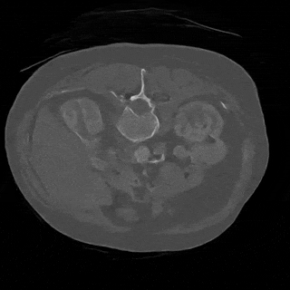
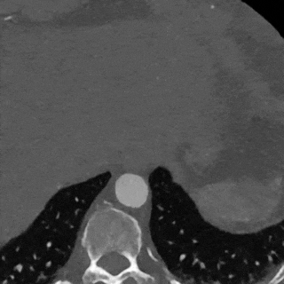
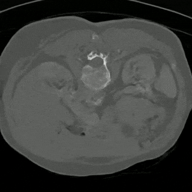
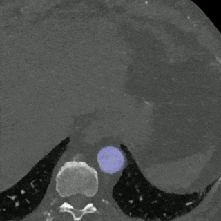
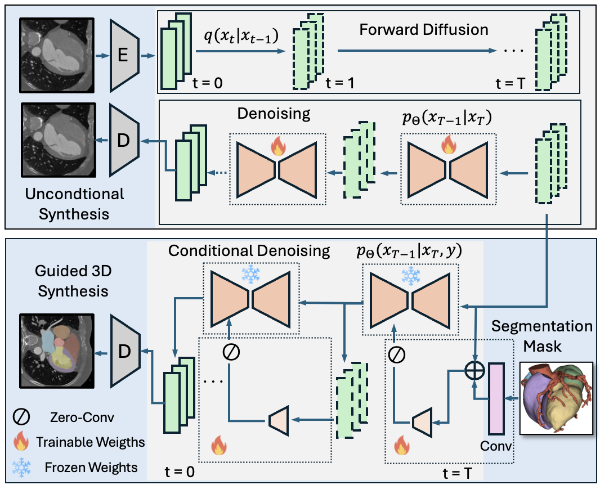

# MedLoRD: A Medical Low-Resource Diffusion Model for High-Resolution 3D CT Image Synthesis

This repository contains the code used for the paper **"MedLoRD: A Medical Low-Resource Diffusion Model for High-Resolution 3D CT Image Synthesis"**, which introduces MedLoRD, a generative diffusion model tailored for computational resource-constrained environments. 
MedLoRD generates high-dimensional medical volumes with resolutions up to **512×512×256**, enabling high-quality synthetic medical image generation on systems with **only 24GB VRAM**.
Here is an overview of the MedLoRD model:

|   |  |
|-----------------------------------------|-----------------------------------------|
| *LUNA Unconditional*                          | *PCCTA Unconditional*                         |

|  |  |
|------------------------------------------|------------------------------------------|
| *LUNA Conditional*                        | *PCCTA Conditional*                        |


## Abstract

Advancements in AI for medical imaging offer significant potential. However, their applications are constrained by the limited availability of data and the reluctance of medical centers to share it due to patient privacy concerns. Generative models present a promising solution by creating synthetic data as a substitute for real patient data. However, medical images are typically high-dimensional, and current state-of-the-art methods are often impractical for computational resource-constrained healthcare environments. These models rely on data sub-sampling, raising doubts about their feasibility and real-world applicability. Furthermore, many of these models are evaluated on quantitative metrics that alone can be misleading in assessing the image quality and clinical meaningfulness of the generated images. To address this, we introduce **MedLoRD**, a generative diffusion model designed for computational resource-constrained environments. MedLoRD is capable of generating high-dimensional medical volumes with resolutions up to **512×512×256**, utilizing GPUs with only **24GB VRAM**, which are commonly found in standard desktop workstations. MedLoRD is evaluated across multiple modalities, including **Coronary Computed Tomography Angiography** and **Lung Computed Tomography** datasets. Extensive evaluations through radiological evaluation, relative regional volume analysis, adherence to conditional masks, and downstream tasks show that MedLoRD generates high-fidelity images closely adhering to segmentation mask conditions, surpassing the capabilities of current state-of-the-art generative models for medical image synthesis in computational resource-constrained environments.
<div align="center">
  
</div>

## Requirements

This project requires Python 3.8 or higher. All dependencies can be installed using the provided **Conda environment**.

## Usage

To train the **MedLoRD** model, follow the steps below. Make sure to set up the environment and install the required dependencies before running the training script.

### 1. Set up the Environment
Create a conda environment to install the required dependencies:

```
conda env create -f environment.yml -n medlord-env
conda activate medlord-env
```

### 2. Prepare Your Dataset
Before training, make sure you have your dataset prepared. The training code expects paths to images stored in a csv file with column name "image" (see preprocess_data notebook file for more information)

### 3. Train Autoencoder
First a VQ-VAE witg GAN loss is trained to encode images into latent space. For that run:

`python ./src/python/training/train_vqgan.py --training_ids=./ids/train_ids.csv --validation_ids=./ids/val_ids.csv --run_dir=VQGAN_v1 --batch_size=1 --eval_freq=10 --n_epochs=500 --adv_start=50 --num_workers=2 --config_file=./configs/stage1/vqgan_ds4.yaml`

### 4. Train Diffusion Model in Latent Space
To train a diffusion model in the learned latent space run:

`python ./src/python/training/train_ldm.py --training_ids=./ids/train_ids.csv --validation_ids=./ids/val_ids.csv --run_dir=LDM_v1 --batch_size=1 --eval_freq=10 --n_epochs=500 --adv_start=50 --num_workers=2 --config_file=./configs/stage1/vqgan_ds4.yaml --vqvae_ckpt=./vqgan_1.pth --scale_factor=1.0`


## License

This code is licensed under the Apache License 2.0. See the LICENSE file for more details.

## Citation
If you use this code in your own research or projects, please cite our paper:
